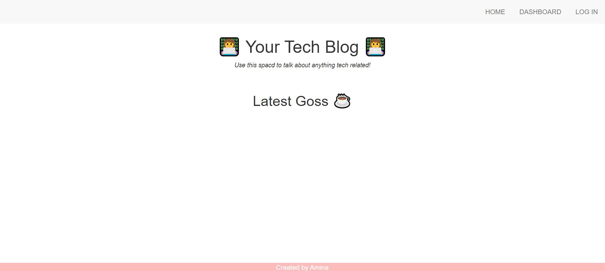

# Tech-Blog

The purpose of this app is to create a tech 'talk space' where users can create an account, create a post, edit, delete, view and add comments to, using MYSQL, JS and MVC.

# Technologies Used
* Handlebars
* SQL
* Javascript
* CSS
* MVC

# Installation
* Start with cloning my repository
* npm install
* node server.js
* voila!

# Tests
no tests ran

# Contributers
Just me

# Heroku Deployed Link
safe-mountain-98504.herokuapp.com
run on http://localhost:3001/

# Screenshot of app

# Repo Link
https://github.com/aminahayat?tab=repositories

# Contact
If you have any questions or would like to use my code in any way, please feel free to contact me on: 
hayat.amina@hotmail.com